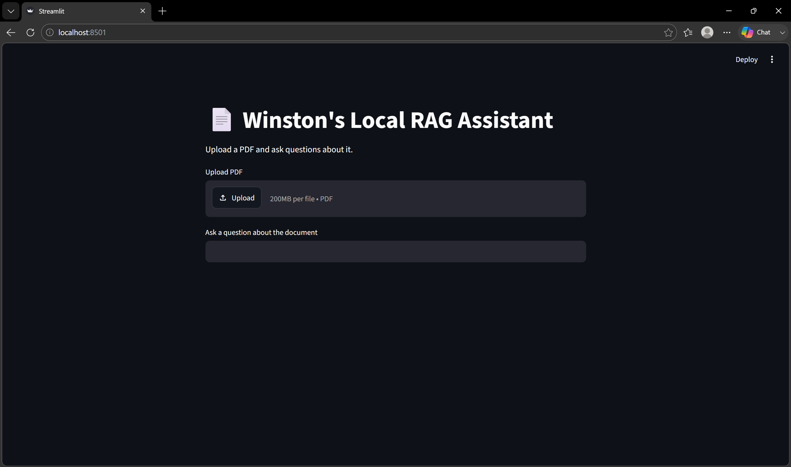

# Document QA RAG

Document QA RAG is a local Retrieval-Augmented Generation application for asking grounded questions about uploaded PDFs. It is intentionally compact: the project demonstrates page-aware ingestion, deterministic chunk provenance, semantic retrieval, evidence-grounded answering, explicit source reporting, retrieval evaluation, and automated testing without presenting itself as a production platform.

## Architecture

```text
PDF upload
    ↓
Page-aware ingestion and deterministic chunking
    ↓
Chunks with document, filename, page, and chunk provenance
    ↓
all-MiniLM-L6-v2 embeddings
    ↓
ChromaDB persistent vector collection
    ↓
Top-k semantic retrieval with distances
    ↓
DocumentQAService
    ↓
Grounded prompt with ordered [S1], [S2], ... evidence
    ↓
Ollama / Llama 3.2 3B
    ↓
Answer plus the exact retrieval evidence used
```

Streamlit is the presentation boundary. PDF parsing, chunking, embeddings, Chroma access, prompt construction, and Ollama interaction live in the `document_qa` package.

## Grounding and evidence

Each indexed chunk retains its content-derived document ID, filename, one-based PDF page, deterministic chunk ID, and text. Retrieval results preserve that provenance together with the distance returned by Chroma.

`DocumentQAService` constructs prompts from explicit, ordered evidence blocks and instructs Llama to use only that evidence. If retrieval produces no usable evidence, the application returns a deterministic insufficient-evidence response without calling Ollama. Distance filtering is supported by the service, but no relevance-distance threshold is enabled by default because one has not been validated. These controls reduce unsupported answers; they do not eliminate hallucinations or prove answer correctness.

## Retrieval evaluation

The local evaluation uses a deterministic eight-page United States Constitution fixture, 12 manually curated questions, and page-level Hit Rate@3.

| Configuration | Chunk size | Overlap | Hit Rate@3 |
|---|---:|---:|---:|
| A | 300 | 60 | 0.92 (11/12) |
| B | 500 | 100 | **1.00 (12/12)** |
| C | 800 | 160 | 0.92 (11/12) |

Configuration B was retained: `chunk_size=500`, `chunk_overlap=100`, and `top_k=3`. It produced the strongest observed result and was already the application default. The dataset is intentionally small and is a portfolio demonstration, not a comprehensive RAG benchmark. See [evaluation/README.md](evaluation/README.md) for corpus attribution, methodology, and limitations.

## Testing

The test suite covers:

- PDF extraction, page provenance, empty documents, and deterministic identifiers;
- indexing and retrieval against in-memory Chroma with deterministic fake embeddings;
- the Ollama boundary without contacting a live Ollama process;
- grounded prompt construction, evidence filtering, and insufficient-evidence behavior with fakes;
- Hit Rate@k and evaluation-dataset validation.

The normal suite contains 29 tests and requires neither network access nor a running Ollama instance.

## Local stack

- Streamlit for the UI
- `pypdf` and LangChain text splitters for ingestion
- Sentence Transformers with `all-MiniLM-L6-v2` for embeddings
- ChromaDB for local persistent retrieval
- Ollama with `llama3.2:3b` for local answer generation

Application data remains local in `chroma_db`. The project does not include cloud deployment or multi-user production infrastructure.

## Installation and use

Clone the actual repository and create a virtual environment:

```bash
git clone https://github.com/winston-lim-dev/document-qa-rag.git
cd document-qa-rag
python -m venv .venv
```

Activate it on Windows PowerShell:

```powershell
.\.venv\Scripts\Activate.ps1
```

Or on macOS/Linux:

```bash
source .venv/bin/activate
```

Install runtime dependencies:

```bash
python -m pip install -r requirements.txt
```

Install [Ollama](https://ollama.com/), ensure its local service is running, and download the configured model:

```bash
ollama pull llama3.2:3b
```

Run the application:

```bash
streamlit run app.py
```

For development and tests:

```bash
python -m pip install -r requirements-dev.txt
pytest
```

Run the retrieval evaluation separately. This loads the production embedding model but does not use Ollama or application Chroma data:

```bash
python evaluation/evaluate.py
```

## Screenshots

The upload screen remains representative of the current Streamlit application:



`Screenshots/answer.png` predates the current evidence display, which now includes filename, page, evidence identifier, and retrieval distance. It should be regenerated manually from a real local run before using it in a portfolio presentation.

## Engineering decisions

- Document IDs are SHA-256 digests of PDF bytes, so identity is content-based rather than filename-based.
- Chunk IDs hash stable document, page, position, and text inputs.
- Chroma `upsert` makes repeated indexing idempotent and does not delete unrelated documents.
- Retrieval and QA results carry complete evidence provenance instead of reducing sources to page numbers.
- The application owns the deterministic insufficient-evidence path and does not call the LLM when no usable evidence remains.
- Retrieval configuration was measured before retaining the existing defaults.

## Limitations

- PDF ingestion depends on extractable text; OCR and scanned-image handling are not implemented.
- Retrieval quality depends on the embedding model, chunking configuration, corpus, and question wording.
- The evaluation corpus and 12-question dataset are deliberately small.
- Answer correctness and faithfulness are not scored automatically.
- No evaluated relevance-distance threshold is enabled by default.
- There is no conversation memory.
- The application is local and single-user; it is not a cloud or multi-user production deployment.
